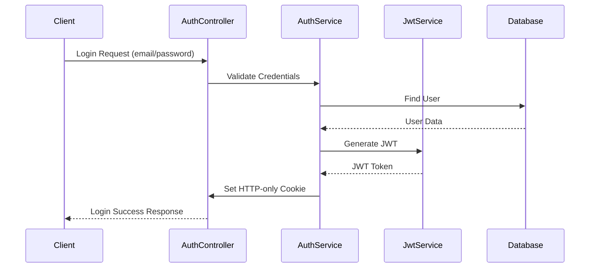

# Authentication Implementation Documentation

## Overview

This document provides a detailed explanation of the authentication system implemented in the Chatter application. The system uses JWT (JSON Web Tokens) for authentication and supports both REST API and GraphQL endpoints.

## Authentication Flow



## Key Components

### 1. AuthModule (`auth.module.ts`)

The central module that orchestrates all authentication-related functionality.

**Purpose:**

- Configures JWT authentication
- Brings together all auth-related components
- Sets up dependency injection

**Key Components:**

- Imports `UsersModule` for user management
- Configures `JwtModule` with secret and expiration
- Provides authentication strategies and services

### 2. AuthService (`auth.service.ts`)

Handles the core authentication logic.

**Purpose:**

- Manages user login process
- Generates JWT tokens
- Handles cookie-based authentication

**Key Methods:**

```typescript
login(user: User, response: Response): Promise<void>
```

- Creates JWT token with user information
- Sets secure HTTP-only cookie
- Configures token expiration

### 3. JWT Strategy (`jwt.strategy.ts`)

Implements Passport.js JWT strategy for token validation.

**Purpose:**

- Extracts JWT from cookies
- Validates token authenticity
- Provides user information to protected routes

**Key Features:**

- Custom cookie extractor
- Token validation using JWT_SECRET
- Payload transformation

### 4. Current User Decorator (`current-user.decorator.ts`)

Custom decorator for accessing authenticated user information.

**Purpose:**

- Provides easy access to current user data
- Supports both REST and GraphQL contexts
- Simplifies controller/resolver implementation

**Usage Example:**

```typescript
@Get('profile')
async getProfile(@CurrentUser() user: User) {
  return user;
}
```

## Security Features

1. **HTTP-Only Cookies**
   - JWT stored in HTTP-only cookies
   - Prevents XSS attacks
   - Not accessible via JavaScript

2. **JWT Configuration**
   - Configurable expiration time
   - Secure token generation
   - Environment-based secret key

## Authentication Flow Details

1. **Login Process**

   ```mermaid
   graph TD
       A[User Login Request] --> B[Validate Credentials]
       B --> C[Generate JWT]
       C --> D[Set HTTP-only Cookie]
       D --> E[Return Success Response]
   ```

2. **Token Validation**
   ```mermaid
   graph TD
       A[Protected Route Request] --> B[Extract JWT from Cookie]
       B --> C[Validate Token]
       C --> D[Extract User Info]
       D --> E[Attach User to Request]
   ```

## Directory Structure

```
src/auth/
├── auth.module.ts       # Main authentication module
├── auth.service.ts      # Authentication service implementation
├── auth.controller.ts   # REST endpoints for auth
├── strategies/
│   ├── jwt.strategy.ts  # JWT authentication strategy
│   └── local.strategy.ts# Local authentication strategy
└── guards/
    └── jwt-auth.guard.ts# Protection for authenticated routes
```

## Environment Configuration

Required environment variables:

- `JWT_SECRET`: Secret key for token signing
- `JWT_EXPIRATION`: Token expiration time in seconds

## Best Practices Implemented

1. Secure cookie configuration
2. Token expiration management
3. Type-safe implementations
4. Separation of concerns
5. Support for multiple contexts (REST/GraphQL)

## Common Use Cases

### 1. Protecting Routes

```typescript
@UseGuards(JwtAuthGuard)
@Get('protected')
async protectedRoute(@CurrentUser() user: User) {
  return `Hello ${user.email}!`;
}
```

### 2. Getting Current User

```typescript
@Query()
@UseGuards(GqlAuthGuard)
async profile(@CurrentUser() user: User) {
  return user;
}
```

## Error Handling

The authentication system handles various error scenarios:

- Invalid credentials
- Expired tokens
- Malformed tokens
- Missing authentication
- Invalid context types

Each error returns appropriate HTTP status codes and error messages.

## Testing

To test protected endpoints:

1. Login to get authentication cookie
2. Include cookie in subsequent requests
3. Use test utilities to mock authentication

## Security Considerations

1. Tokens are stored securely in HTTP-only cookies
2. Passwords are never returned in responses
3. Token expiration is enforced
4. Environment variables are used for sensitive data
5. Type safety is maintained throughout the system
